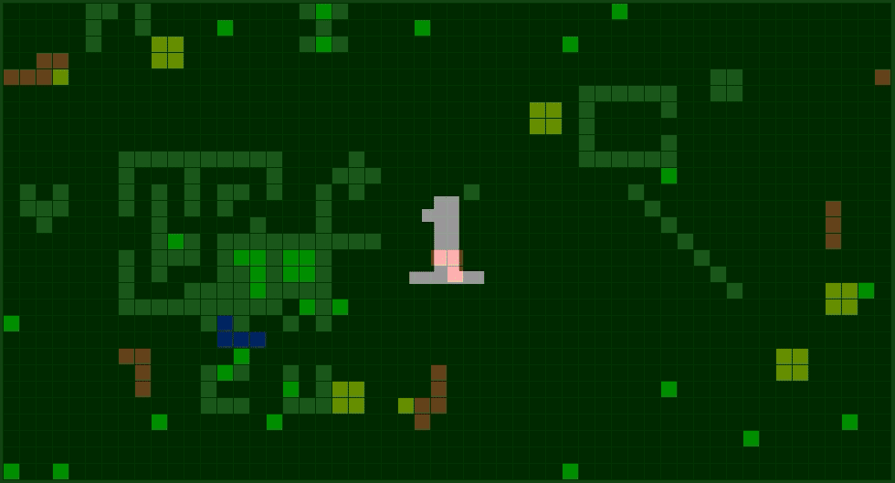

# Snake-Server [](https://travis-ci.org/ivan1993spb/snake-server) [](https://goreportcard.com/report/github.com/ivan1993spb/snake-server) [](https://github.com/ivan1993spb/snake-server/releases/latest) [](LICENSE)

Snake-Server is a server for online arcade game - snake. See working instance here - http://snakeonline.xyz

## Table of contents

- [Game rules](#game-rules)
- [Demo](#demo)
- [Basic usage](#basic-usage)
- [Installation](#installation)
  * [Download and install binary](#download-and-install-binary)
  * [Build and install latest server](#build-and-install-latest-server)
  * [Pull server image from docker-hub](#pull-server-image-from-docker-hub)
  * [Build and install server of specific version from source code](#build-and-install-server-of-specific-version-from-source-code)
  * [Deploy the server with ansible playbook](#deploy-the-server-with-ansible-playbook)
- [CLI arguments](#cli-arguments)
- [Clients](#clients)
- [API description](#api-description)
  * [API requests](#api-requests)
  * [API errors](#api-errors)
- [Game Web-Socket messages description](#game-web-socket-messages-description)
  * [Game primitives](#game-primitives)
  * [Game objects](#game-objects)
  * [Output messages](#output-messages)
  * [Input messages](#input-messages)
- [License](#license)

## Game rules

* A player controls a snake.
* The task of the game is to grow the biggest snake and dominate.
* In order to achieve the goal players may eat apples, mouses, watermelons, small snakes and remains of dead snakes of other players.
* If a snake hits a wall the snake dies and the player starts again with a new small snake.
* A snake may eat another snake if it's length greater or equal to the square of length of the second one.

## Demo

[](http://snakeonline.xyz)

[Try it out!](http://snakeonline.xyz)

## Basic usage

Start snake-server:

* Using binary:
  ```bash
  snake-server --enable-web
  ```
* Or docker:
  ```
  docker run --rm -p 8080:8080 ivan1993spb/snake-server --enable-web
  ```

Open in a browser http://localhost:8080/.

## Installation

There are many options to get Snake-Server. You can download the server binary, build the server from the source code or pull the server docker image. See below.

### Download and install binary

You can download binary from the releases page: https://github.com/ivan1993spb/snake-server/releases/latest

Or using curl:

* Setup variables *VERSION*, *PLATFORM* (darwin, linux or windows) and *ARCHITECTURE* (386 or amd64):
  ```bash
  VERSION=v4.2.0
  PLATFORM=linux
  ARCHITECTURE=amd64
  ```
* Use curl to download snake-server binary:
  ```bash
  curl -sL https://github.com/ivan1993spb/snake-server/releases/download/${VERSION}/snake-server-${VERSION}-${PLATFORM}-${ARCHITECTURE}.tar.gz | sudo tar xvz -C /usr/local/bin/
  ```
* Then use `snake-server -h` to see the usage information.

### Build and install latest server

In order to build Snake-Server you need installed [Go compiler](https://golang.org/) (version 1.10+ is required).

The simpliest way to install the latest Snake-Server is to run go-get command to load the source code from the master branch, build and install snake-server into `${GOPATH}/bin` directory:

```bash
go get -u github.com/ivan1993spb/snake-server
snake-server -h
```

### Pull server image from docker-hub

Firstly, you need docker to have been installed: [use fast installation script](https://get.docker.com/).

See snake-server docker-hub repository: https://hub.docker.com/r/ivan1993spb/snake-server.

Choose image tag from the [tags list](https://hub.docker.com/r/ivan1993spb/snake-server/tags/).

* Use `docker pull ivan1993spb/snake-server` to pull server image from docker-hub
* `docker run --rm -p 8080:8080 --name snake-server ivan1993spb/snake-server --enable-web` to start server
* `docker run --rm ivan1993spb/snake-server -h` for usage information

Add alias for running snake-server container:

* `alias snake-server="docker run --rm -p 8080:8080 --name snake-server ivan1993spb/snake-server"`
* `snake-server --help`

### Build and install server of specific version from source code

You can get the Snake-Server source code of a specific version by curl:

* `mkdir -p ${GOPATH}/src/github.com/ivan1993spb/snake-server`
* Download and extract source code `curl -sL https://github.com/ivan1993spb/snake-server/archive/${VERSION}.tar.gz | tar xvz --strip 1 -C ${GOPATH}/src/github.com/ivan1993spb/snake-server`
* `cd ${GOPATH}/src/github.com/ivan1993spb/snake-server`

Then there are three options how to build the server from the sources:

* Build the server binary using Go compiler
* Build the server binary using Docker
* Build the Docker image

#### Build the server binary using Go compiler

In order to build Snake-Server you need Go compiler (version 1.10+ is required) to have been installed. [Get Go compiler](https://golang.org/).

If you have appropriate Go compiler, use:

* `make VERSION=${VERSION} BUILD=custom`
* `make install VERSION=${VERSION} BUILD=custom`

Then:

* Use `snake-server -h` to see the usage information
* `snake-server --enable-web` to start the server

#### Build the server binary using Docker

If you have got Docker, use:

* `make go/build VERSION=${VERSION} BUILD=custom`
* Move snake-server to `/usr/local/bin/`: `mv snake-server /usr/local/bin/`

Then:

* Use `snake-server -h` to see the usage information
* `snake-server --enable-web` to start the server

#### Build Docker image

In order to build Snake-Server Docker image you need Docker to have been installed [Docker](https://www.docker.com/) (version 18+ is required)

Use command `make docker/build` to build the image.

Then:

* Use `docker run --rm ivan1993spb/snake-server -h` to see the usage information
* `docker run --rm -p 8080:8080 --name snake-server ivan1993spb/snake-server --enable-web` to start the server

### Deploy the server with ansible playbook

The playbook repository is [here](https://github.com/ivan1993spb/snake-ansible).

```bash
git clone https://github.com/ivan1993spb/snake-ansible.git
```

## CLI arguments

Use `snake-server --help` for help info.

Arguments:

* `--address` - **string** - address to serve (default: *:8080*). For example: *:8080*, *localhost:7070*
* `--conns-limit` - **int** - opened web-socket connections limit (default: *1000*)
* `--groups-limit` - **int** - game groups limit for server (default: *100*)
* `--enable-web` - **bool** - the flag to enable the web client (default: *false*)
* `--enable-broadcast` - **bool** - the flag to enable the broadcasting API method (default: *false*)
* `--log-json` - **bool** - set this flag to use JSON log output format (default: *false*)
* `--log-level` - **string** - set log level: *panic*, *fatal*, *error*, *warning* (*warn*), *info* or *debug* (default: *info*)
* `--seed` - **int** - random seed (default: the number of nanoseconds elapsed since January 1, 1970 UTC)
* `--tls-cert` - **string** - path to certificate file
* `--tls-enable` - **bool** - flag: enable TLS
* `--tls-key` - **string** - path to key file

## Clients

There is an embedded JavaScript web-client for the server. You can enable the client using cli flag `--enable-web`.

You are welcome to create your own client using the described API.

Some samples you can see here:

* VueJS client repo: https://github.com/ivan1993spb/snake-lightweight-client
* PyGame client repo: https://github.com/ivan1993spb/snake-desktop-client
* Python client repo: https://github.com/ivan1993spb/snake-client

## API description

All the API methods provide JSON format. If errors are occurred the methods return HTTP statuses and JSON formatted error objects. See [openapi.yaml](openapi.yaml) for details. Also, see API curl examples below.

Use header `X-Snake-Client` to specify a client name, version and build hash. For example:

```
X-Snake-Client: SnakeLightweightClient/v0.3.2 (build 8554f6b)
```

### API requests

#### Request `POST /api/games`

Request creates a game and returns JSON game object.

```
curl -s -X POST -d limit=3 -d width=100 -d height=100 -d enable_walls=true http://localhost:8080/api/games | jq
{
  "id": 1,
  "limit": 3,
  "count": 0,
  "width": 100,
  "height": 100,
  "rate": 0
}
```

`enable_walls` - optional parameter, default value is `true`

#### Request `GET /api/games`

Request returns an information about all games on server.

```
curl -s -X GET http://localhost:8080/api/games | jq
{
  "games": [
    {
      "id": 1,
      "limit": 10,
      "count": 0,
      "width": 100,
      "height": 100,
      "rate": 0
    },
    {
      "id": 2,
      "limit": 10,
      "count": 0,
      "width": 100,
      "height": 100,
      "rate": 0
    }
  ],
  "limit": 100,
  "count": 2
}
```

#### Request `GET /api/games/{id}`

Request returns an information about a game by id.

```
curl -s -X GET http://localhost:8080/api/games/1 | jq
{
  "id": 1,
  "limit": 10,
  "count": 0,
  "width": 100,
  "height": 100,
  "rate": 0
}
```

#### Request `DELETE /api/games/{id}`

Request deletes a game by id if there is not players in the game.

```
curl -s -X DELETE http://localhost:8080/api/games/1 | jq
{
  "id": 1
}
```

#### Request `POST /api/games/{id}/broadcast`

Request sends a message to all players in selected game. Returns `true` on success. **Request body size is limited: maximum 128 bytes**

```
curl -s -X POST -d message=text http://localhost:8080/api/games/1/broadcast | jq
{
  "success": true
}
```

If request method is disabled, you will get 404 error. See [CLI arguments](#cli-arguments).

#### Request `GET /api/games/{id}/objects`

Request returns all objects on the map of a game with passed identifier.

```
curl -s -X GET http://localhost:8080/api/games/1/objects | jq
{
  "objects": [
    {
      "id": 99,
      "dots": [
        [0, 2],
        [1, 2],
        [0, 0],
        [1, 0],
        [1, 1],
        [2, 1]
      ],
      "type": "wall"
    },
    {
      "id": 124,
      "dot": [18, 16],
      "type": "apple"
    },
    {
      "id": 312,
      "dots": [
        [9, 17],
        [10, 17],
        [9, 18],
        [10, 18]
      ],
      "type": "watermelon"
    }
  ]
}
```

#### Request `GET /api/capacity`

Request returns the server instance capacity metric. Capacity is the number of opened web-socket connections divided by the number of allowed connections for the server instance.

```
curl -s -X GET http://localhost:8080/api/capacity | jq
{
  "capacity": 0.02
}
```

#### Request `GET /api/info`

Request returns a common information about the server: author, license, version, build.

```
curl -s -X GET http://localhost:8080/api/info | jq
{
  "author": "Ivan Pushkin",
  "license": "MIT",
  "version": "v4.0.0",
  "build": "85b6b0e"
}
```

#### Request `GET /api/ping`

Request returns pong response from the server.

```
curl -s -X GET http://localhost:8080/api/ping | jq
{
  "pong": 1
}
```

### API errors

API methods return error status codes (400, 404, 500, etc.) with error description in JSON format: `{"code": error_code , "text": error_text }`. JSON error structure can contains additional fields.

Example:

```
curl -s -X GET http://localhost:8080/api/games/1 -v | jq
*   Trying 127.0.0.1...
* Connected to localhost (127.0.0.1) port 8080 (#0)
> GET /api/games/0 HTTP/1.1
> Host: localhost:8080
> User-Agent: curl/7.47.0
> Accept: */*
>
< HTTP/1.1 404 Not Found
< Server: Snake-Server/v3.1.1-rc (build 85b6b0e)
< Vary: Origin
< Date: Wed, 20 Jun 2018 12:24:44 GMT
< Content-Length: 44
< Content-Type: application/json; charset=utf-8
<
{ [44 bytes data]
* Connection #0 to host localhost left intact
{
  "code": 404,
  "text": "game not found",
  "id": 1
}
```

## Game Web-Socket messages description

The request `ws://localhost:8080/ws/games/1` connects to the game Web-Socket JSON stream by a game identificator.

When a connection has been established, the server handler does:

* Initializes the game session
* Returns the playground size
* Returns all objects on the playground
* Creates a snake
* Returns the snake identifier
* Pushes game events and objects to the web-socket stream

There are *input* and *output* web-socket messages.

### Game primitives

To explain game objects there is the primitives:

* Direction: `"north"`, `"west"`, `"south"`, `"east"`
* Dot: `[x, y]`
* Dot list: `[[x, y], [x, y], [x, y], [x, y], [x, y], [x, y]]`
* Rectangle: `[x, y, width, height]`

### Game objects

Game objects:

* Snake:
  ```json
  {
    "type": "snake",
    "id": 12,
    "dots": [[4, 3], [3, 3], [2, 3]]
  }
  ```
* Apple:
  ```json
  {
    "type": "apple",
    "id": 123,
    "dot": [3, 2]
  }
  ```
* Corpse:
  ```json
  {
    "type": "corpse",
    "id": 142,
    "dots": [[3, 2], [3, 1], [3, 0]]
  }
  ```
* Mouse:
  ```json
  {
    "type": "mouse",
    "id": 123,
    "dot": [3, 2],
    "direction": "south"
  }
  ```
* Watermelon:
  ```json
  {
    "type": "watermelon",
    "id": 123,
    "dots": [[4, 4], [4, 5], [5, 4], [5, 5]]
  }
  ```
* Wall:
  ```json
  {
    "type": "wall",
    "id": 351,
    "dots": [[4, 2], [2, 1], [2, 3]]
  }
  ```

### Output messages

Output messages are sent by server to a client.

Output message structure:

```
{
  "type": output_message_type,
  "payload": output_message_payload
}
```

Output message types:

* *game* - message payload contains a game events. Game events have a type and a payload:
  ```
  {"type": game_event_type, "payload": game_event_payload}
  ```
  Game events contain information about creation, updation, deletion of game objects on a playground.
* *player* - message payload contains a player specific info. Player messages have a type and a payload:
  ```
  {"type": player_message_type, "payload": player_message_payload}
  ```
  Player messages contain user specific game information such as user notifications, errors, the snake identifier, etc.
* *broadcast* - message payload contains a group broadcasted messages. Payload of a output message of type *broadcast* contains **string** - message

Examples:

```
{
  "type": "player",
  "payload": ...
}
{
  "type": "game",
  "payload": ...
}
{
  "type": "broadcast",
  "payload": ...
}
```

#### Game events

Output message type: *game*

Game event types:

* *error* - a payload contains a **string**: error description
* *create* - a payload contains a game object that was created
* *delete* - a payload contains a game object that was deleted
* *update* - a payload contains a game object that was updated
* *checked* - a payload contains a game object that was checked by another game object (deprecated)

Examples:

```
{
  "type": "game",
  "payload": {
    "type": "create",
    "payload": {
      "id": 41,
      "dots": [[9, 9], [9, 8], [9, 7]],
      "type": "snake"
    }
  }
}
{
  "type": "game",
  "payload": {
    "type": "update",
    "payload": {
      "id": 123,
      "dots": [[19, 6], [19, 7], [19, 8]],
      "type": "snake"
    }
  }
}
{
  "type": "game",
  "payload": {
    "type": "checked",
    "payload": {
      "id": 421,
      "dots": [[6, 17], [6, 18], [6, 19], [7, 19], [8, 19], [8, 20], [8, 21]],
      "type": "corpse"
    }
  }
}
{
  "type": "game",
  "payload": {
    "type": "update",
    "payload": {
      "id": 142,
      "dots": [[6, 17], [6, 18], [6, 19], [7, 19], [8, 19], [8, 20], [8, 21]],
      "type": "corpse"
    }
  }
}
```

#### Player messages

Output message type: *player*

Player messages types:

* *size* - a payload contains a playground size **object**: `{"width":10,"height":10}`
* *snake* - a payload contains a **string**: snake identifier
* *notice* - a payload contains a **string**: notification
* *error* - a payload contains a **string**: error description
* *countdown* - a payload contains an **int**: number of seconds for countdown
* *objects* - a payload contains a list of all objects on the playground. A message containing all objects on a playground is necessary to initialize the map on client side

Examples:

```
{
  "type": "player",
  "payload": {
    "type": "notice",
    "payload": "welcome to snake-server!"
  }
}
{
  "type": "player",
  "payload": {
    "type": "size",
    "payload": {
      "width":255,
      "height":255
    }
  }
}
{
  "type": "player",
  "payload": {
    "type": "objects",
    "payload": [
      {
        "id": 21,
        "dot": [17, 18],
        "type": "apple"
      },
      {
        "id": 63,
        "dots": [[24, 24], [25, 24], [26, 24]],
        "type": "corpse"
      }
    ]
  }
}
{
  "type": "player",
  "payload": {
    "type": "countdown",
    "payload": 5
  }
}
```

#### Broadcast messages

Output message type: *broadcast*

Payload of output message of type *broadcast* contains a **string** - a group notice to be sent to the all players in a game.

Example:

```json
{
  "type": "broadcast",
  "payload": "hello world!"
}
```

### Input messages

Input messages are sent by a client to a server.

Input message structure:

```
{
  "type": input_message_type,
  "payload": input_message_payload
}
```

Input message types:

* *snake* - when a player sends a game command in message payload to control the snake
* *broadcast* - when a player sends a short phrase or emoji to broadcast it for players in a game

**Input message size is limited: maximum 128 bytes**

#### Snake input message

Snake input message contains a game command. A game command sets player's snake direction if it possible.

Accepted commands:

* *north* - sets snake direction to north
* *east* - sets snake direction to east
* *south* - sets snake direction to south
* *west* - sets snake direction to west

Examples:

```
{
  "type": "snake",
  "payload": "north"
}
{
  "type": "snake",
  "payload": "east"
}
{
  "type": "snake",
  "payload": "south"
}
{
  "type": "snake",
  "payload": "west"
}
```

#### Broadcast input message

A broadcast input message contains a short message to be sent to all players in a game.

Examples:

```
{
  "type": "broadcast",
  "payload": "hello!"
}
{
  "type": "broadcast",
  "payload": ";)"
}
```

## License

See [LICENSE](LICENSE).
